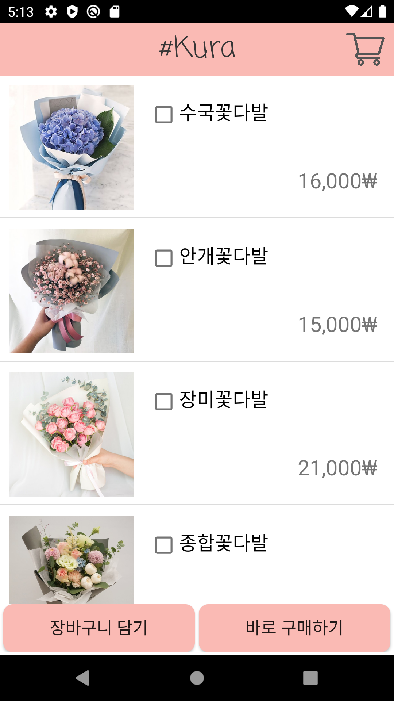

<h1 align="center"> #Kura🌸</h1>

    
    
    

#Kura = Shop Kura = Shop + Sakura
> 국민대학교 2020-2 모바일프로그래밍 과제입니다.

 
 

## :cherry_blossom: 과제 내용

> **1. 평가 : 첫번째 화면 5점, 두번째 화면 5점, 세번째 화면 5점
>      (만점 15점, 각 화면의 구성+동작으로 평가)**
>
> **2. 총점 : 15점
>   \* 가산점: Firebase 연동**  *** 감점 : 동작중 비정상적인 앱 종료** 
>
> **첫번째 화면 (Relative Layout 혹은 Fragment 사용)****
> **- 상품 선택 페이지
> \- 상품은 2개이상 화면에 출력. 각 상품의 제품명, 가격 정보 표시 
> \- 상품 선택하면 아래에 버튼으로 구매 혹은 장바구니 선택
> \- 장바구니 버튼을 클릭시에는 두번째 화면으로 이동
> \- 구매 버튼을 클릭시에는 세번째 화면으로 이동
>
> **두번째 화면 (Linear Layout 혹은 Fragment 사용)
> **- 장바구니 페이지
> \- 장바구니에 추가한 상품명, 가격 정보 출력
> \- 구매 버튼과 홈버튼을 출럭
> \- 홈버튼을 클릭하면 첫번째 페이지로 이동
> \- 상품별로 선택(Radio 버튼, 체크 박스 활용) 여부 체크후에
>  구매 버튼을 클릭하면 세번째 페이지로 이동
>
> **세번째 화면 (Table Layout, Grid Layout 중 하나 사용)
> **- 구매 페이지
> \- 선택한 제품명, 가격 정보를 출력
> \- 선택한 제품이 여러개면 결재할 총합 선택
> \- 주소정보, 연락처 입력
> \- 구매 완료시에 첫번째 화면으로 이동
>
> \* 각페이지 구성시에 View을 상속한 여러가지 위젯을 사용하여 화면을 구성
>  (기능에 맞는 위젯 선택하여 구성)
>   ListView, GridView, AdapterView, ToolBar, Text View, CheckBox, Switch, 
>   ToggleButton, RadioButton, ImageView, ImageButton 등

 
 

## :cherry_blossom: 구현 내용

#### 상품선택 화면
 

