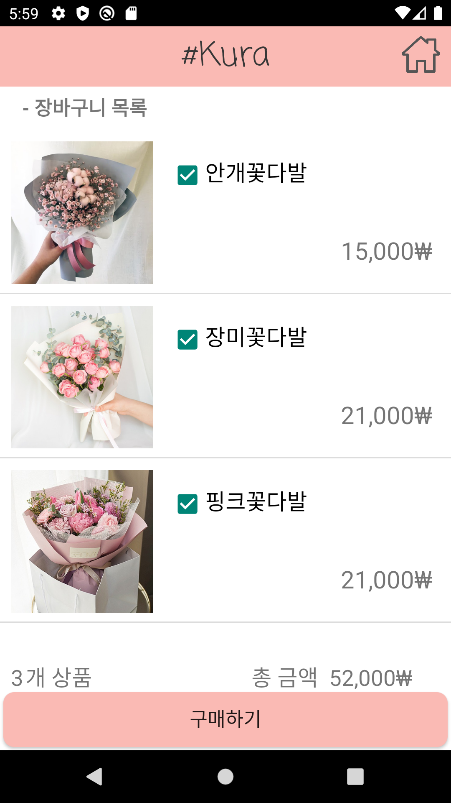

<h1 align="center"> #Kura🌸</h1>
#### #Kura = Shop Kura = Shop + Sakura
> 국민대학교 2020-2 모바일프로그래밍 과제입니다.
> 
> 소프트웨어학부 20191556 김민정

## :cherry_blossom: 구현 내용

### 1. 상품선택 페이지

##### 처음 앱을 실행했을 때

##### 우측 상단 장바구니 버튼 클릭시 장바구니로 이동

##### 상품을 선택하지 않고 장바구니 담기, 바로 구매하기 버튼 클릭 시 메세지 출력

##### 상품 여러개 선택 가능

### 2. 장바구니 페이지

##### 아무것도 선택하지 않고 상단 버튼을 이용해 장바구니에 진입 시 빈 장바구니 출력

##### 상품 선택 후 장바구니 버튼을 클릭하면 장바구니에 담기게 됨

##### 상품 선택 해제 할 시 선택 수량, 총 금액 변동

    
    &nbsp;
    

##### 상품을 선택하지 않고 구매하기 버튼 클릭시 메세지 출력

##### 우측상단 홈버튼 클릭 시 다시 상품선택 페이지로 돌아감

### 3. 구매 페이지

##### 상품 선택 후 구매페이지 진입 시

##### 주문자 정보를 입력하지 않고 결제하기 버튼 클릭 시

##### 주문자 정보 작성 후 결제하기 버튼 클릭 가능

### 4. 구매완료 페이지

##### 주문자 정보가 있을 때 결제하기 클릭 시 구매완료 페이지 출력

##### 홈으로 이동 버튼이나 뒤로가기 클릭 시 새 상품선택 페이지로 이동

## :cherry_blossom: 과제 소감

> 처음에 앱 개발을 시작했을 때에는 매우 막막했다. 학교 수업을 들으며 어찌저찌 따라가고는 있었으나, 앱 개발이 처음이고 배운 내용만으로 내가 만들고 싶은 앱을 구현하기에는 무리가 있어 많은 공부가 필요했다.
>
> 처음으로 앱의 UI를 디자인하면서, 생각보다 꽤 어려운 작업이 되겠구나 싶었다. 아직은 근사하지는 않지만 그래도 이런 그래픽적인 요소가 들어가는 작업에 소홀히 할 수 없는 성격이라, 가뜩이나 시간도 모자란데 예쁘게 꾸미겠다고 오래 붙잡고 있었다. UI를 설계하면서 어떤 Widget, View들이 필요할 지 생각하고 대략적인 Layout을 구상했다.
>
> 실제로 앱을 개발하는데 시간을 많이 사용하지 못해서 firebase를 연동하는 등의 부가적인 기능을 개발하지 못했다. 이 점에서 많이 아쉽다. 조금만 더 시간을 투자했다면 더 풍부한 기능을 개발할 수 있었을 텐데 하는 아쉬움이 있고, 공부해보지 못했다는 점이 아깝다. 추후에 가능하다면 스스로 세부적인 기능을 추가로 구현하고 싶다.